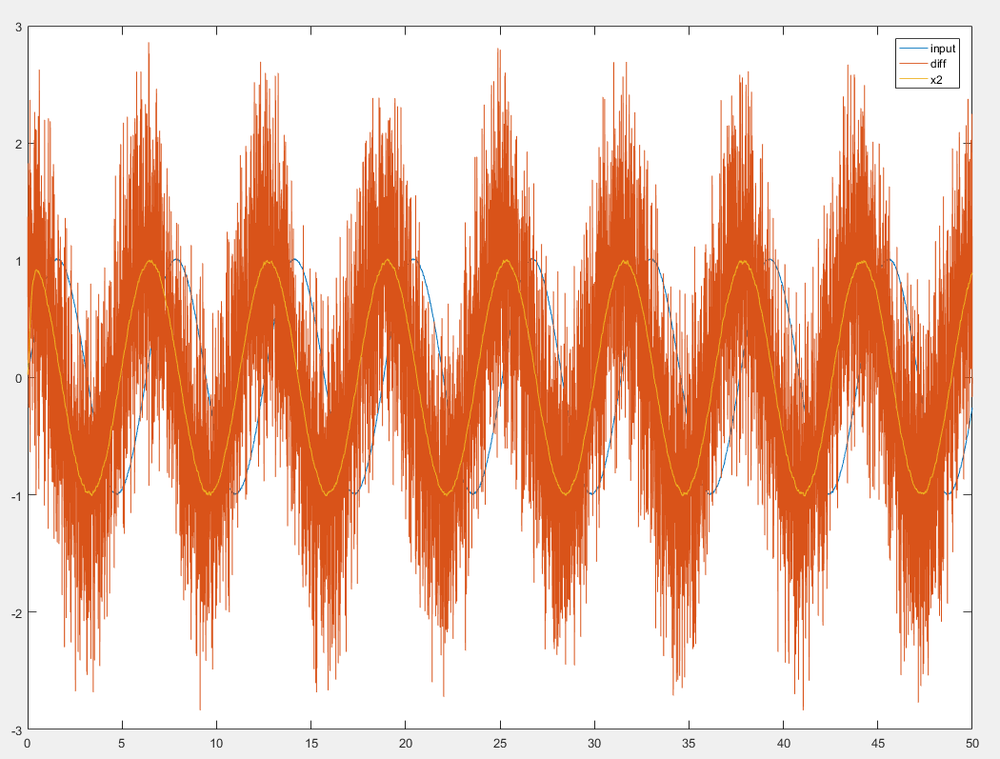
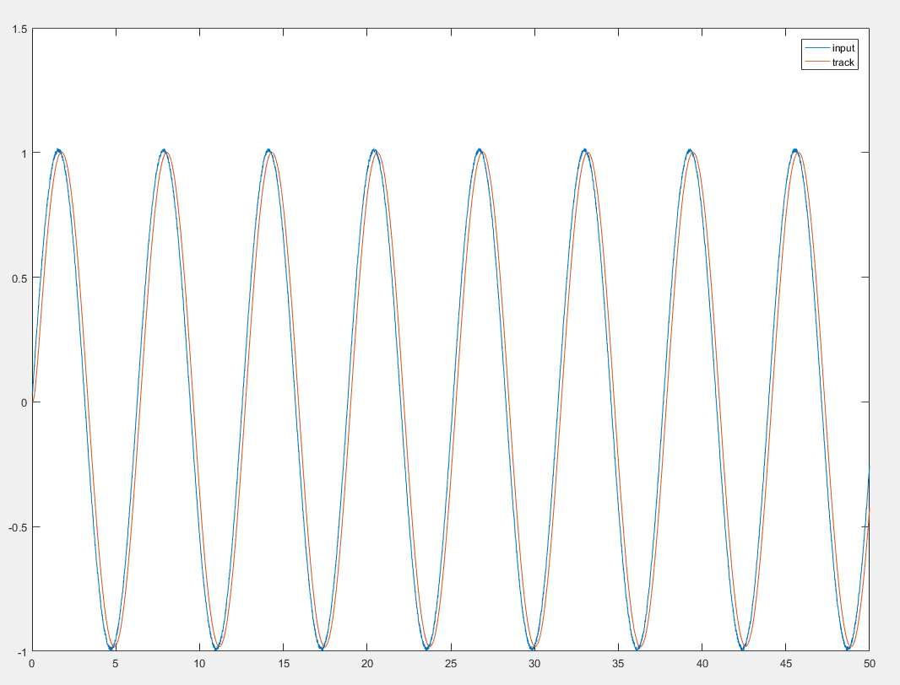
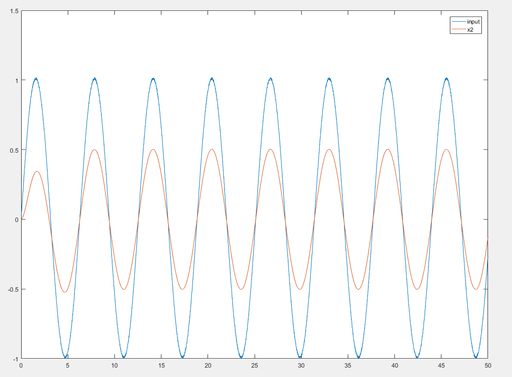
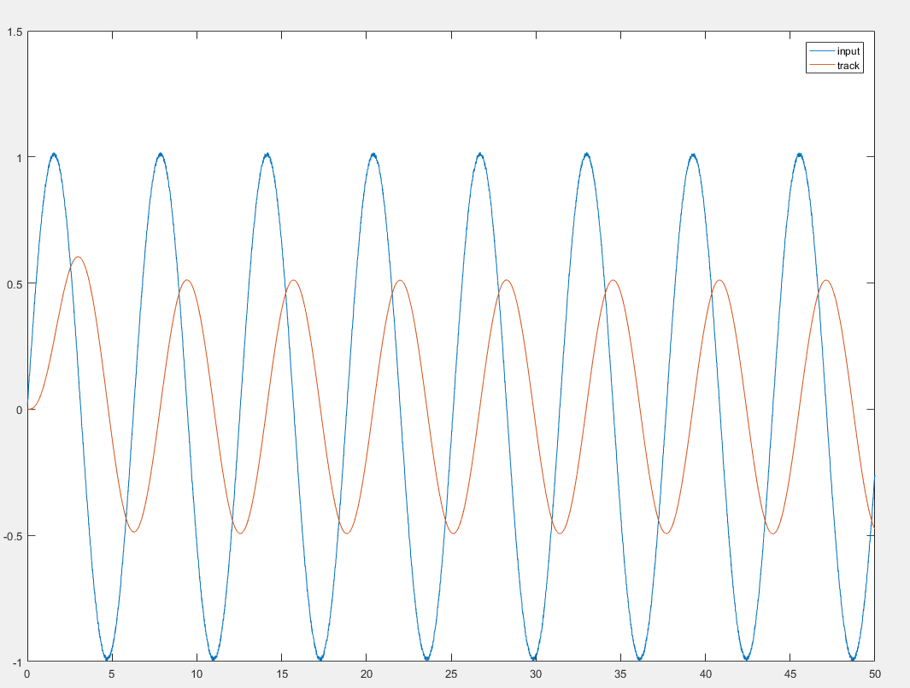
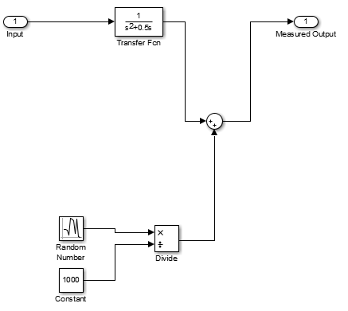
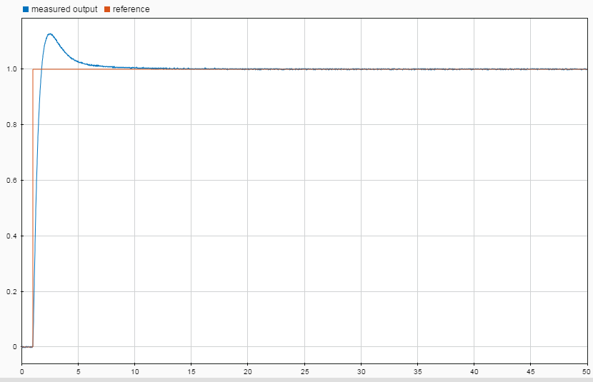
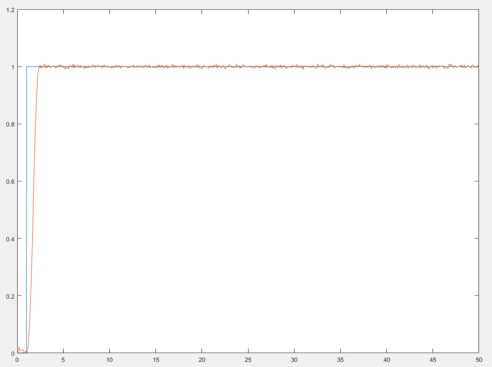
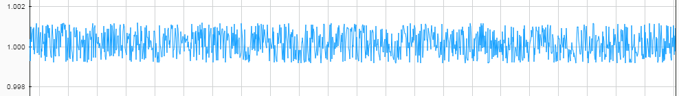
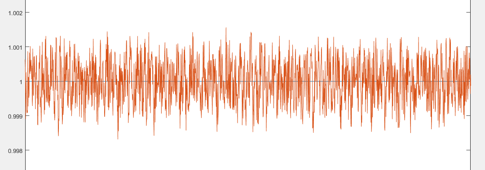

小白理解ADRC控制器
==========
整篇文章仅包含毫无意义的公式，有意义的公式都在书里，小白请放心食用:stuck_out_tongue_winking_eye:

## 引入
### 传统PID存在的问题
传统上，对于模型不确定的系统我们(或者仅仅是我？)都喜欢用PID控制。
即使在模型清楚的情况下，有时我们也很难获得模型的部分参数，所以继续沿用PID控制器。

一般我们看到的的pid控制是长这样的：

如果把这样的pid控制器写成传递函数，就是

=P+I\\frac{1}{s}+Ds)

Z变换的话是变成

=P+I\cdot{T_s}\\frac{1}{z-1}+D\\frac{z-1}{z\cdot{T_s}})

嗯~看起来挺不错的，那么问题在哪儿呢？

#### 微分不可用
在实际场景中，上面的pid控制上存在一个巨大的问题，即D分量一般并不可用。因为对象输出c(t)存在噪声，简单做微分会导致噪声引入系统导致系统不稳定。

#### 超调&&过渡过程

任何一个控制器，其最终目的都是希望输出c(t)尽可能快地跟踪输入r(t)。在大多数情况下，我们希望这个跟踪没有超调和振荡。然而这个愿望可能实现吗？

我们观察一个二阶系统：

=\\frac{a_1}{s^2+a_2s+a_1})

当且仅当时，系统是临界阻尼状态，此时系统既没有超调振荡，跟踪速度也是较快的。
而我们制作的控制器也是希望能修改原有的传递函数，使得其能实现类似于临界阻尼这样的状态。对于大多数二阶系统而言，PID控制就能做到。

但如果a1和a2在系统运行中有些许变化怎么办？
额，这时候简单的PID就要出事了。（至于为什么，额，我数学不好，谁有兴趣谁推导:joy:）

其实在我们输入r(t)的时候，输入的期望是不连续的(比如阶跃)。
在调节时间ts内，我们实际上在强控制器所难，因为它的输出本来就不可能到达我们期望的输入。
如果不作理论推导(又不做推导，我这样是要被打的:dizzy_face:)，单凭直觉，我们很容易想象，一个含有惯性过程的系统，在e(t)较大的情况下很可能出现超调的情况。
如果我们换个思路，为控制器设计一个合理的过渡过程，是不是能减轻下这个控制器的负担，初始u(t)不会过大，超调也会减少一部分。

#### 积分反馈的问题
PID中的I项是用于抑制常值扰动，减少稳态误差的。然而添加I项可能导致系统动态特性变差，又有积分饱和的问题。这项这么扔着真的好么。

#### PID控制器本身
PID是将比例、积分、微分做线性加权和作为调节器输出扔给被控对象的(类似单个无偏置神经元？:point_left:)。这么做是不是合适？用非线性组合是不是更好？

## ADRC控制器
ADRC控制器结构如下图所示：

[过渡过程{bg:green}],[过渡过程]v1->[sum_1],[过渡过程]v2->[sum_2],[扩张状态观测器{bg:orange}]z1_n->[sum_1],[扩张状态观测器]z2_n->[sum_2],[sum_1]e1->[非线性组合],[sum_2]e2->[非线性组合{bg:red}],[非线性组合]u0->[sum_3],[sum_3]u->[对象],[对象]->[output],[output]y->[扩张状态观测器],[sum_3]->[b0],[b0]->[扩张状态观测器],[扩张状态观测器]z3_n->[1/b0],[1/b0]->[sum_3]" >

是不是看着很乱？哈哈~我只是想安利一下这个
[画图工具](https://yuml.me/diagram/scruffy/class/samples)。

正常的画风是这样的：

看着是不是和那些个pid好不一样。
照我的理解，原有的PID相当于这之中的**非线性组合**，
而**过渡过程构建**、**扩张状态观测器**这两个是新添加的模块。
抛去**非线性组合**，我们先来看看剩下的两个。

#### 过渡过程构建(跟踪微分器TD)
ADRC中的动态过程是通过跟踪微分器来实现的。
跟踪微分器本不是用于实现动态过程，是为了从被污染的信号中求取微分而设计的。
然后对微分进行积分，得到跟踪信号。
由于这个微分是进行滞后和滤波的，所以所得跟踪信号的带宽也有所限制。
这样得到的跟踪信号即可看做是原有信号的**动态过程**。

传统上，微分可以由传递函数

=\\frac{1}{T}\(1-\\frac{1}{Ts+1}\))

得到，式中，T为采样间隔时间。即微分 = (现在-过去)/采样间隔。显然，在输入信号含噪的情况下，这样的微分会放大噪声直至微分信号被淹没。

跟踪微分器中，将微分的传递函数变成了

=\\frac{1}{\tau_2-\tau_1}\(\\frac{1}{\tau_1s+1}-\\frac{1}{\tau_2s+1}\))

即两个惯性环节相减，目的是通过惯性环节降低噪声。
进一步地，整理上式并令τ2无限接近于τ1，可得

=\\frac{s}{\tau^2s^2+2\tau{s}+1})

令r = τ可得

=\\frac{r^2s}{s^2+2rs+r^2})

看下这是个啥。
实际上，这就是一个二阶临界阻尼系统的微分。

状态变量方程为

写成离散方程的样子，就变成一个实际可用的跟踪微分器，即

x1为跟踪输出，x2为微分输出，h为采样周期
差分效果如下所示

跟踪效果如下所示

看起来不错，那么这么做的代价是什么。
眼尖的同学可能已经看出来了，跟踪有滞后。其实这么做，微分和跟踪都会有滞后。
我们将r的值改小一点看看。

发现了吧，微分滞后到几乎没有超前了，而跟踪滞后了90°，并且幅值也变小了。系统的带宽被限制了。
从另一个角度来看，这样的限制为系统增加了**过渡过程**。
因为系统实际上由于惯性的原因不可能完全跟踪输入，适当设计过渡过程可以降低超调。
此外我这儿说的是线性的跟踪微分器，
最优跟踪微分器有所改动，但思路是一脉相承的，想了解的可以看下书。

#### 扩张状态观测器（ESO）

##### 状态观测器（SO）

这一部分我感觉书上讲的比较模糊(话说整本书都是以实验为主线)，那我就讲得更模糊一点好了。
状态观测器的作用就是根据系统输入和输出估计系统的状态信息。
观察一个二阶系统

由于a1,a2未知，我们只能根据输出y和输入u估计整个状态变量z。
一个全维状态观测器是这样的，通过引入l1、l2进行修正。

令e = z1-x1那么

e_1+a_2e_2)

因此只要l1、l2选取得当，e->0，观测器输出z逼近真实的状态变量x。
当然，你要是开心的话可以给e们过一个函数提高性能。

##### 扩张状态观测器（ESO）

那么**扩张状态观测器**究竟**扩张**在哪儿了呢？
对于一个二阶系统，假设其

+u)

中的f(x1,x2)进行扩张，使得

)

=w(t))

对，这个扩张出来的x3就是所谓的扩张状态，构建包含x3，输出z={z1,z2,z3}的观测器就是扩张状态观测器。

### 细枝末节

其他细枝末节的东西不高兴写了，TD、控制组合、ESO都可以有线性的，也可以有非线性的(~~类比激活函数:joy:大误~~)。

## 测试一下
看如下一个二阶含噪系统

使用PID以及简单自动tune以后，输出是这样的。

使用ADRC简单手动调参，输出是这样的。

ADRC效果很出众吧！
~~但其实有隐忧，对比下稳态输出的噪声。~~
~~稳态噪声相差10倍~猜测原因是~~
* ~~没有积分?~~
* ~~各种非线性?~~

**我matlab写错了，把噪声传回了传递函数里面重新算了，改了bug后噪声相差没有十倍，抱歉了。修改后的图如下**

PID:

ADRC:

以上。

## ~~参考文献~~
[1]韩京清. 自抗扰控制技术: 估计补偿不确定因素的控制技术[M]. 国防工业出版社, 2008.